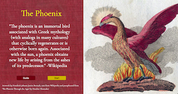

# Choose Your Own Adventure : The Phoenix

 ## Goal of the Game
The goal of the game is to have found three feathers before the timer runs out, and earn the chance to find the phoenix at the end. 
 
 ## How to Choose Your Own Adventure

 1. Upon arriving to each scenerio, you will have the opportunity to find a feather BEFORE making the choice for the next scenerio. Hovering over the scenerio will allow you to find it, don't forget to click! 

 2. The feathers you collect will give you a boon, that when consumed will save you from a perilous choice. Choose wisely! 

 3. It is not required to search for a feather, but without all three it will be impossible to find the phoenix. 
 

 ## Getting Started 
[Start](https://carol-kang-cyoa-the-phoenix.netlify.app/)  
If any pop-up windows show up, close them before moving on. 
 
 ## Planning
[Whimsical](https://whimsical.com/choose-your-own-adventure-the-phoenix-XCFTsaKJM1NAHhjj1KHafo) 
 
 ## Technologies Used
JavaScript, HTML, CSS, Git, Bootstrap 
 
 ## Credits
- [Wikipedia](https://en.wikipedia.org/wiki/Phoenix_(mythology))
- [The Phoenix Through the Ages, by Heather Shumaker](https://www.swarthmore.edu/bulletin/archive/wp/october-2008_the-phoenix-through-the-ages.html)
- Artwork: Friedrich Justin Bertuch
  - [Wikipedia](https://en.wikipedia.org/wiki/Phoenix_(mythology))
  - [uni-heidelberg](https://digi.ub.uni-heidelberg.de/diglit/bertuch1798bd3/0159/image,thumbs#col_thumbs)
  - [Clip-Art](http://clipart-library.com/)
  - [Book-Art-Texture](https://lostandtaken.com/downloads/vintage-book-cover-textures-6/)
  - [Font](https://fonts.google.com/)

- Audio: [freesound.org](https://freesound.org/people/angelkunev/sounds/561287/)
- Thank you (again) to this [article/comments](https://css-tricks.com/restart-css-animation/) that helped me fix the animation reset.
- Thank you to this [article](https://www.quackit.com/javascript/popup_windows.cfm) regarding pop up window. 
 

 ## Next Steps 
- Create more environments, and randomize the choices. 
- Refactor code 
- Make image names more consistent 
- Make the Resurrection message more aesthetically pleasing to the eye 
